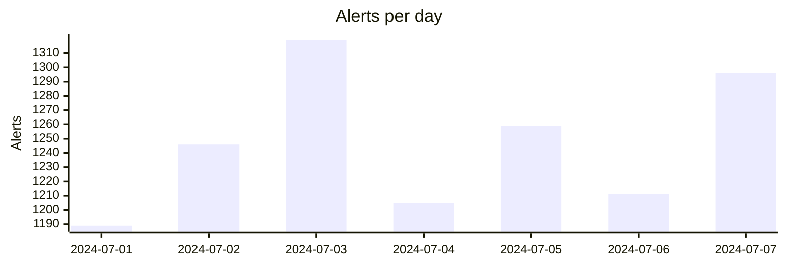
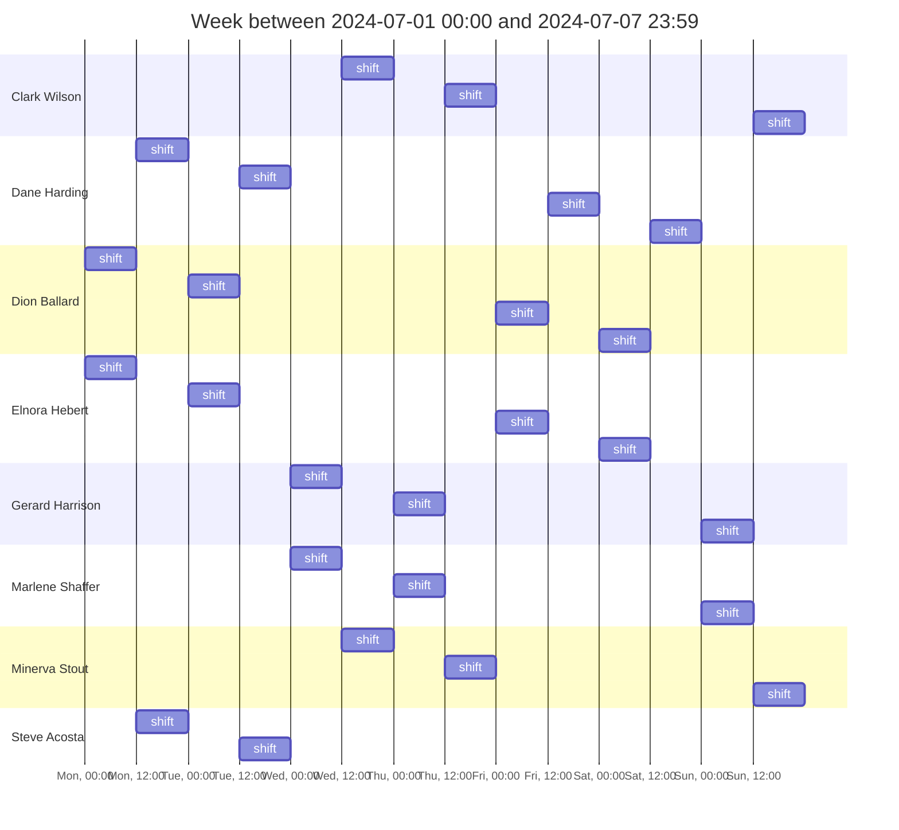

# SOC Weekly Activity Overview

As part of our ongoing commitment to transparency and collaboration, we are sharing the weekly overview report
for the Security Operations Center (SOC) activities for the week between
Mon, Jul 01, 2024 00:00:00 CEST and
Sun, Jul 07, 2024 23:59:59 CEST.

## Exec Summary

During the current reporting period, the cybersecurity team addressed 10 critical alerts, with 4 resolved within the one-hour SLA and an average response time of 0.43 hours. High-severity alerts numbered 135, with 120 handled within the three-hour SLA, averaging 2.4 hours for response. Medium-severity alerts saw 3960 out of 7018 resolved within the six-hour SLA, with an average response time of 7.3 hours. Low-severity alerts had 900 out of 1557 resolved within the 24-hour SLA, with an average response time of 8.3 hours.

Notable incidents included high-severity threats such as "Volume Shadow Copy Deletion via WMIC" and "Process Created with an Elevated Token," which represent significant risks. The false-positive rate was 41.03%, with 3580 false positives and 5145 true positives identified. The team adjusted detection capabilities by disabling three and enabling five new rules, with a total of 1161 active rules. Analyst coverage remained consistent with eight analysts on shift.

### Materialized risk

There were 5 alerts in the current week with materialised risk.

|Rule Name|Severity|Alerts|
|---|---|---|
| Volume Shadow Copy Deletion via WMIC | high | 1 |
| Process Created with an Elevated Token | high | 1 |
| Uncommon Registry Persistence Change | medium | 1 |
| Windows Event Logs Cleared | low | 2 |

In the past week, we have observed several critical security alerts with materialized risks. There was a high-severity alert for "Volume Shadow Copy Deletion via WMIC," indicating the use of wmic.exe to delete shadow copies, often linked to ransomware or other destructive attacks. Another high-severity alert, "Process Created with an Elevated Token," highlighted the creation of a process running with SYSTEM privileges, suggesting an adversary's attempt to escalate privileges and bypass access controls. A medium-severity alert, "Uncommon Registry Persistence Change," detected modifications to registry persistence keys, potentially indicating a stealthy persistence attempt by an adversary. Additionally, there were two low-severity alerts for "Windows Event Logs Cleared," identifying attempts to clear event log stores, a common tactic used by attackers to evade detection and destroy forensic evidence.

## KPIs

### SLA Metrics

|Severity|Alerts|Limit|SLA met / not met|% met|TimeToRespond|
|---|---|---|---|---|---|
|critical|5|<= 1h|4/1|80%|0.43h|
|high|135|<= 3h|120/15|88.89%|2.4h|
|medium|7028|<= 6h|3960/3068|56.34%|7.3h|
|low|1557|<= 24h|900/657|57.80%|22.3h|

### True / False Positives resolved before risk materialisation

- *True Positives*: 5145
- *False Positives*: 3580
- *FP %*: 41.03%

### Estate coverage

#### Fleet agents

**New agents enrolled in the current week**: 13 (previous week: 7)

**Agents that missed their check-in**: 4

#### Detection rules

Rule status changes in the current week:

*Changed to Enabled* (5):

- AWS Bedrock Guardrails Detected Multiple Violations by a Single User Over a Session
- AWS Config Resource Deletion
- AWS EC2 EBS Snapshot Shared with Another Account
- Suspicious JAVA Child Process
- Potential Shell via Wildcard Injection Detected

*Changed to Disabled* (3):

- Potential Successful SSH Brute Force Attack
- Suspicious macOS MS Office Child Process
- Unexpected Child Process of macOS Screensaver Engine

*Overall enabled rules*: 1161

## Rule Performance

The rules producing the most FP alerts:

- **Suspicious JAVA Child Process** (medium severity): 87 alerts
- **Suspicious macOS MS Office Child Process** (medium severity): 33 alerts
- **Unexpected Child Process of macOS Screensaver Engine** (medium severity): 30 alerts
- **Potential Cross Site Scripting (XSS)** (low severity): 27 alerts
- **Linux User Added to Privileged Group** (low severity): 15 alerts

Rules failing the most:
- **Unusual Web Request**: 210 failures
- **Unusual DNS Activity**: 176 failures
- **Unusual Country For an AWS Command**: 150 failures
- **Port Forwarding Rule Addition**: 73 failures
- **Potential Privilege Escalation via Service ImagePath Modification**: 30 failures

## Analytical Load

### Alerts Overview

8725 alerts were created last week.

|Severity|Alerts|Alerts (week before)|Change|
|---|---|---|---|
|critical|10|3|233.33%|
|high|135|217|-37.79%|
|medium|7018|7210|-2.5%|
|low|1557|876|77.73%|

- MTTR: 7.29h
- 95th percentile: 7.1h

### Alerts per on-duty analyst

- *Unattended hours*: 0h with 0 alerts
- *Dead hours without any alerts*: 0h

| Analyst | Shifts | Hours alone | Avg alerts/h |
|---|---|---|---|
| Clark Wilson | 3 | 0 | 24.82 |
| Dane Harding | 4 | 24 | 37.03 |
| Dion Ballard | 4 | 0 | 26.61 |
| Elnora Hebert | 4 | 0 | 26.61 |
| Gerard Harrison | 3 | 0 | 28.26 |
| Marlene Shaffer | 3 | 0 | 28.26 |
| Minerva Stout | 3 | 0 | 24.82 |
| Steve Acosta | 2 | 0 | 23.83 |

## Feedback

Feel free to reach out if you have any specific questions or require additional information regarding the provided report.
