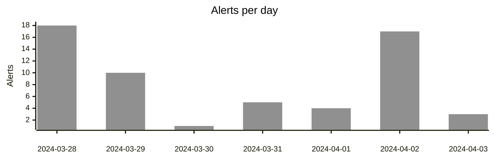

# Weekly Activity Overview

As part of our ongoing commitment to transparency and collaboration, we are sharing the weekly overview report
for the Security Operations Center (SOC) activities for the week ending April 4, 2024.

## Key Metrics

- Total Alerts: 58
- Total Cases: 4

## Alerts Overview

There were 58 alerts created in the last week.

|Severity|Alerts|Alerts (week before)|Change|
|---|---|---|---|
|high|0|0|0%|
|medium|54|47|15%|
|low|4|4|0%|

The breakdown of the alerts per rule name is as follows:

|Rule Name|Alerts|
|---|---|
|Malware Detection Alert|33|
|Memory Threat Detection Alert: Windows.Trojan.CobaltStrike|5|
|Malicious Behavior Detection Alert: Initial Access Discovery via Applet Executable|4|
|Malicious Behavior Detection Alert: Potential Payload Download via AppleScript Applet|4|
|Test Ransomware Rule v2|4|
|Potential macOS SSH Brute Force Detected|4|
|Malicious Behavior Detection Alert: Curl from Volume Mount|2|
|Malicious Behavior Detection Alert: Network Module Loaded from Suspicious Unbacked Memory|2|

### Alerts Trends and Observations

The trend analysis based on the provided data indicates a slight increase in the number of alerts seen this week compared to the previous week. The "Malware Detection Alert" remained consistent with 33 alerts this week compared to 32 in the previous week. There was a slight decrease in "Memory Threat Detection Alert" from 5 to 4, while certain malicious behavior alerts saw minor fluctuations. Overall, there were more unique alerts triggered this week, suggesting a potential increase in security events that need monitoring and investigation.

## Security Cases Overview

| Status  | Count |
|---|---|
| **Open** | critical severity: 1   high severity: 1  |
| **Closed** | 1 |
| **In Progress** | 1 |

### Cases Summary

Over the past week, the SOC team has been actively investigating a medium-severity malware incident on Windows systems, analyzing reported suspicious emails related to phishing through Outlook, and addressing a high-severity issue involving an unusual process discovered on Linux systems. Their focus has been on mitigating these security threats and safeguarding the organization's information assets.

There is 1 case that has been open for more than a week.

## Feedback

Feel free to reach out if you have any specific questions or require additional information regarding the provided report.

